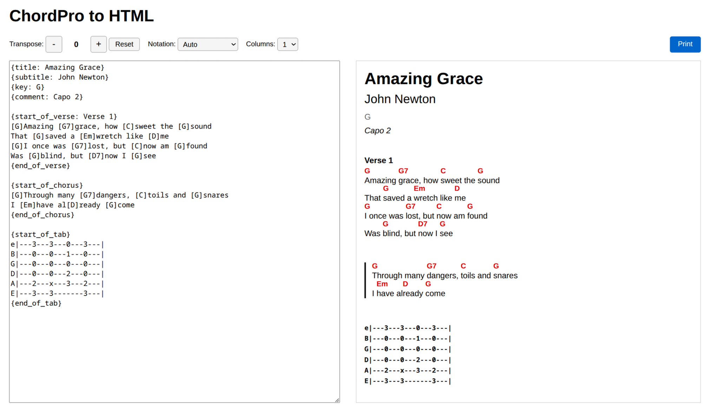

# chordpro2html

Convert [ChordPro](https://www.chordpro.org/chordpro/chordpro-introduction/) format into print-ready HTML. Supports chord transposition (including German H/B notation) and multi-column layout.

## Installation

```bash
npm install
```

## Web Application



Start the development server:

```bash
npm run dev
```

This opens a browser UI with a ChordPro editor on the left and a live HTML preview on the right. The toolbar provides:

- **Transpose** -- shift all chords up or down by semitones using the +/- buttons
- **Notation** -- switch between Standard (B) and German (H/B) chord naming
- **Columns** -- render the song in 1-4 columns
- **Print** -- print the preview or save it as PDF (toolbar and editor are hidden automatically)

## CLI

Convert a ChordPro file to HTML:

```bash
npx tsx src/cli/index.ts song.chordpro
```

Write the output to a file:

```bash
npx tsx src/cli/index.ts song.chordpro > song.html
```

### Options

| Flag | Description |
|------|-------------|
| `-t N`, `--transpose N` | Transpose by N semitones (positive = up, negative = down) |
| `-c N`, `--columns N` | Number of columns (default: 1) |
| `-h`, `--help` | Show usage information |

### Examples

Transpose up by 2 semitones:

```bash
npx tsx src/cli/index.ts -t 2 song.chordpro
```

Transpose down by 3 semitones and use 2 columns:

```bash
npx tsx src/cli/index.ts -t -3 -c 2 song.chordpro > song.html
```

## Library

The core library can be used programmatically:

```typescript
import { chordproToHtml } from "chordpro2html";

const html = chordproToHtml(chordproText, {
  transpose: 2,          // semitones (optional)
  notation: "german",    // "standard" | "german" (optional, auto-detected)
  columns: 2,            // number of columns (optional)
  fullPage: true,        // wrap in a complete HTML document (optional)
});
```

For more control, use the individual pipeline stages:

```typescript
import { parse, transpose, render } from "chordpro2html";

const song = parse(chordproText);
const transposed = transpose(song, 3, { notation: "german" });
const html = render(transposed, { fullPage: true, columns: 2 });
```

## Development

```bash
npm run build        # compile TypeScript
npm test             # run tests
npm run test:watch   # run tests in watch mode
npm run lint         # lint with ESLint
```
